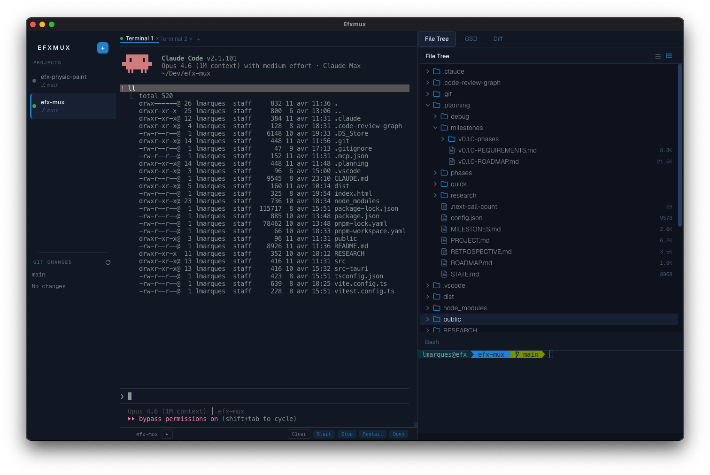

# Efxmux



**A native macOS terminal multiplexer for AI-assisted development.**

Efxmux wraps Claude Code and OpenCode terminal sessions in a structured, multi-panel workspace. It co-locates the AI agent terminal, a live GSD progress viewer with checkbox write-back, git diff, file tree, and a secondary bash terminal — all around a real PTY connected to tmux. No wrapping, no protocol hacks, just the raw binary in a native window.

> Developers using Claude Code or OpenCode lose context switching between the terminal, their editor, and their planning docs. Efxmux collapses all of that into one native window with a terminal-first aesthetic — dark, fast, keyboard-driven.

---

## Why Efxmux

- **Zero wrapping** — Claude Code and OpenCode run as native PTY processes inside tmux. Full color, full interactivity, zero compatibility issues.
- **Persistent sessions** — Close the app, reopen it. Your layout, tabs, and tmux sessions are exactly where you left them. Processes keep running in the background.
- **Live planning panel** — Render your GSD `PLAN.md` with progress bars and checkboxes. Click a checkbox in the panel, it writes back to the `.md` file on disk, and Claude Code sees the change. Bidirectional.
- **Git diff at a glance** — GitHub-style unified diff viewer powered by `git2` (no shell-out). See what changed without leaving the workspace.
- **Project-scoped workspaces** — Register multiple projects. Switch between them and the terminal session, git status, file tree, and GSD viewer all update atomically.
- **Native performance** — Tauri 2 + Rust backend. WebGL-accelerated terminal rendering via xterm.js 6.0. Sub-20ms input latency.

---

## Features

### Terminal

- Real xterm.js 6.0 terminal connected to a live PTY via tmux
- WebGL2 GPU-accelerated rendering with automatic DOM fallback
- Flow control with backpressure (400KB high / 100KB low watermark)
- PTY output streamed via Tauri IPC channels for ordered, low-latency delivery
- Correct terminal resize (SIGWINCH) when panel splits are dragged
- Multi-tab terminal with per-project tab isolation and persistence
- Crash recovery overlay with "Restart Session" button

### Theming

- Navy-blue dark palette with layered depth and refined typography (Geist / Geist Mono)
- User-defined terminal colors via `~/.config/efx-mux/theme.json`
- iTerm2 `.json` profile auto-conversion
- Hot-reload: save `theme.json` and all terminals re-theme instantly
- Light mode with harmonized white palette

### Layout

- 3-zone layout: collapsible sidebar + main terminal + right panel (top/bottom split)
- Drag-resizable splits with persisted ratios
- Sidebar toggles between 40px icon strip and full-width (Ctrl+B)
- Collapsible server pane at the bottom of the main panel (Ctrl+S)

### Right Panel Views

| Tab | Description |
|-----|-------------|
| **GSD** | Markdown viewer with live file watching, progress bars, and checkbox write-back |
| **Diff** | GitHub-style unified diff with colored additions/deletions and +/- stats |
| **File Tree** | Interactive directory tree with folder collapse, inline icons, and keyboard navigation |
| **Bash** | Independent xterm.js terminal for ad-hoc commands |

### Project System

- Register projects with path, name, agent type, GSD file, and server command
- Sidebar shows project list with git branch badges and file change counts (M/S/U)
- Fuzzy-search project switcher (Ctrl+P)
- Atomic project switch: terminal session, git status, file tree, GSD viewer all update together

### Agent Support

- Auto-detect `claude` or `opencode` binary on PATH
- Launch directly in tmux PTY — no wrapping, no protocol interception
- Per-project agent configuration
- Agent header card with version info, model name, and status pill
- Fallback to plain bash with informational banner if agent not found

### Server Pane

- Collapsible bottom split with strip/expanded toggle
- Run your dev server with ANSI color output
- Controls: Open in Browser, Restart, Stop
- Per-project server isolation — servers keep running across project switches

### Keyboard

| Shortcut | Action |
|----------|--------|
| Ctrl+B | Toggle sidebar |
| Ctrl+S | Toggle server pane |
| Ctrl+T | New terminal tab |
| Ctrl+W / Cmd+W | Close tab |
| Ctrl+Tab | Cycle tabs |
| Ctrl+P | Fuzzy project switcher |
| Ctrl+, | Preferences |
| Ctrl+/ | Keyboard cheatsheet |
| Cmd+K | Clear terminal |
| Ctrl+C/D/Z/L/R | Always passed through to PTY when terminal is focused |

### Session Persistence

- Full layout state saved to `~/.config/efx-mux/state.json`
- On reopen: layout restored, tabs restored, tmux sessions reattached
- Dead session detection with fresh session creation
- Corrupted state fallback to safe defaults
- First-run wizard for initial project setup

---

## Tech Stack

| Layer | Technology |
|-------|-----------|
| Shell | [Tauri 2](https://v2.tauri.app) (Rust) |
| Frontend | [Preact](https://preactjs.com) + [Signals](https://preactjs.com/guide/v10/signals/) |
| Bundler | [Vite](https://vite.dev) |
| Styling | [Tailwind CSS 4](https://tailwindcss.com) |
| Language | TypeScript 6 |
| Terminal | [xterm.js 6.0](https://xtermjs.org) + WebGL addon |
| PTY | [portable-pty](https://docs.rs/portable-pty) (Rust) |
| Sessions | tmux |
| Git | [git2](https://docs.rs/git2) (libgit2 bindings, no shell-out) |
| File watching | [notify](https://docs.rs/notify) (Rust) |
| Markdown | [marked](https://marked.js.org) |
| Icons | [Lucide](https://lucide.dev) |
| Fonts | Geist, Geist Mono, FiraCode |

---

## Design System

Efxmux uses a navy-blue palette with layered depth, designed for long coding sessions:

| Token | Dark | Light |
|-------|------|-------|
| Background | `#111927` | `#FFFFFF` |
| Elevated | `#19243A` | `#F6F8FA` |
| Deep | `#0B1120` | `#FFFFFF` |
| Border | `#243352` | `#D0D7DE` |
| Surface | `#324568` | `#E8ECF0` |
| Accent | `#258AD1` | `#258AD1` |
| Text | `#E6EDF3` | `#1F2328` |
| Text Muted | `#8B949E` | `#59636E` |

Typography: **Geist** for UI chrome, **Geist Mono** for code and section labels, **FiraCode** inside xterm.js.

---

## Prerequisites

- **macOS** (Monterey 12+ recommended)
- **tmux** 3.x+ (`brew install tmux`)
- **Rust** toolchain (`rustup`)
- **Node.js** 18+ and **pnpm**
- **Claude Code** or **OpenCode** (optional — falls back to plain bash)

## Getting Started

```bash
# Clone the repository
git clone https://github.com/your-username/efx-mux.git
cd efx-mux

# Install dependencies
pnpm install

# Run in development mode (Vite + Tauri hot-reload)
pnpm tauri dev

# Build for production
pnpm tauri build
```

On first launch, the setup wizard will guide you through adding your first project and selecting your AI agent.

---

## Architecture

```
src/                          # Frontend (Preact + TypeScript)
  components/                 # 16 UI components
    sidebar.tsx               # Project list, git status, collapsible
    main-panel.tsx            # Primary terminal + server pane
    right-panel.tsx           # Tabbed views (GSD/Diff/FileTree/Bash)
    terminal-tabs.tsx         # Tab lifecycle, per-project persistence
    agent-header.tsx          # Agent info card with status
    gsd-viewer.tsx            # Markdown viewer with write-back
    diff-viewer.tsx           # GitHub-style unified diff
    file-tree.tsx             # Interactive directory tree
    server-pane.tsx           # Dev server controls
    ...
  terminal/                   # xterm.js management
    terminal-manager.ts       # Create/configure xterm instances
    pty-bridge.ts             # Tauri IPC ↔ PTY communication
    resize-handler.ts         # SIGWINCH propagation
  tokens.ts                   # Design system tokens
  state-manager.ts            # App state persistence
  main.tsx                    # Entry point + keyboard handler

src-tauri/                    # Backend (Rust)
  src/
    terminal/pty.rs           # PTY spawning, flow control, tmux
    theme/                    # Theme loading, hot-reload, iTerm2 import
    state.rs                  # State persistence (state.json)
    project.rs                # Project registration and switching
    git_status.rs             # git2 integration
    file_watcher.rs           # notify-based file watching
    server.rs                 # Dev server process management
    file_ops.rs               # File read/write for frontend
```

---

## What Efxmux Is Not

- **Not a text editor** — Files open in your `$EDITOR` via a terminal tab
- **Not an AI shell copilot** — Claude Code _is_ the AI; Efxmux is the workspace around it
- **Not cross-platform** — macOS first. No Windows/Linux support planned for v0.1
- **Not a collaboration tool** — Solo developer workspace, no cloud sync
- **Not a plugin platform** — Focused tool, not an extensible framework

---

## License

MIT

---

Built with Tauri, Preact, xterm.js, and tmux. Designed for developers who live in the terminal.
